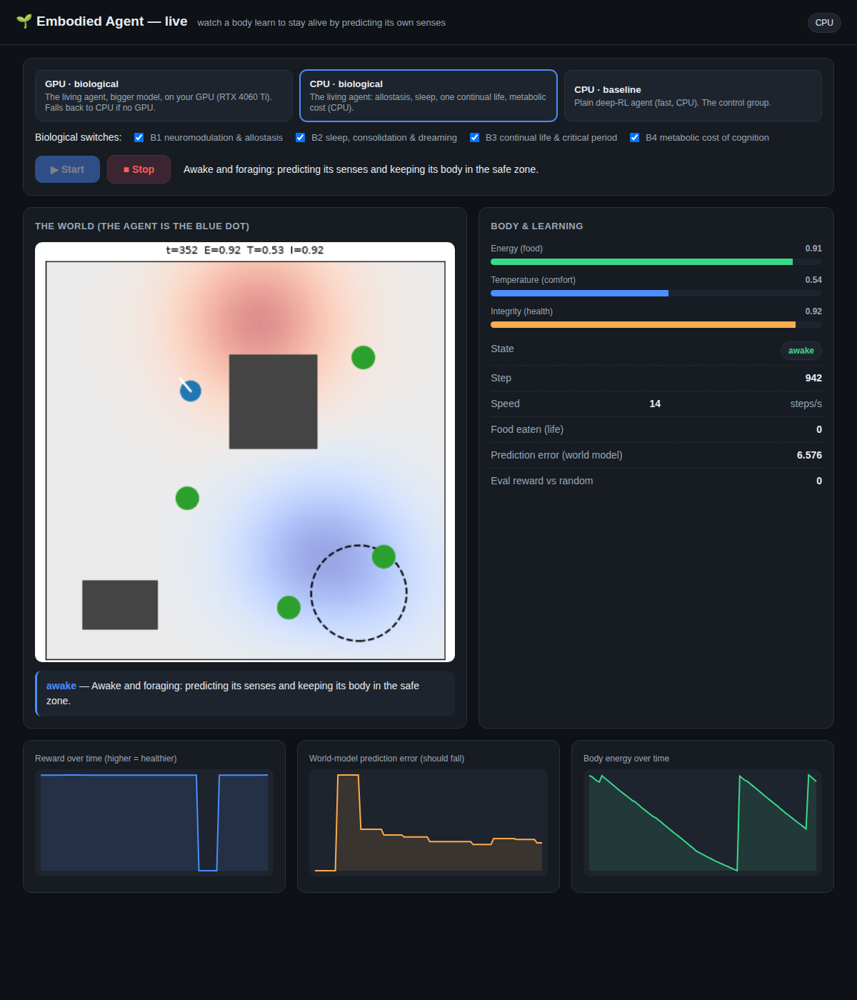

# Quick start — watch a digital creature learn to stay alive

This project grows a small artificial "animal" that lives in a 2‑D world. It
isn't told what to do. It only tries to **predict its own senses** and keep its
body healthy (fed, warm, uninjured). Curiosity, fear, foraging, even sleep and
evolution emerge from that. You can watch it happen live in your browser.

No coding needed. Two steps: **install once**, then **run**.

---

## 1. What you need

- A **Windows or Linux/Mac** computer.
- An **NVIDIA GPU is optional** but nice (e.g. a laptop RTX 4060 Ti). Without
  one it still runs, just slower, on the CPU.
- About **2 GB of disk** for the install (mostly PyTorch).

You do **not** need to install Python separately on most systems — but if the
installer complains it can't find Python, install Python 3.10+ from
[python.org](https://www.python.org/downloads/) (on Windows, tick *"Add Python
to PATH"*), then re-run.

## 2. Install (do this once)

**Windows:** double‑click **`install.bat`**. A window opens and sets everything
up (this takes a few minutes the first time — PyTorch is a big download).

**Linux / Mac:** open a terminal in this folder and run:

```bash
bash install.sh          # add --cpu if you have no NVIDIA GPU
```

When it finishes it prints a green ✅ and tells you whether it found your GPU.

## 3. Run — open the dashboard

**Windows:** double‑click **`run.bat`**.
**Linux / Mac:** `bash run.sh`

Your browser opens to a dashboard. If it doesn't, go to
**http://localhost:8000** yourself.

## 4. Watch it live



1. Pick a **scenario** at the top:
   - **🐜 Colony · community** — a *whole population* of creatures living
     together in one bigger world: they forage the same food, bump into each
     other, breed into live offspring (new dots appear, coloured by
     generation), starve, die, and evolve in place. The most fun to watch.
     **Click any creature** to see through its eyes (its live first-person
     senses appear in the "What it senses" panel).
   - **GPU · biological** — one full "living" creature on your GPU (recommended
     if you have one).
   - **CPU · biological** — the same single creature, runs anywhere.
   - **CPU · baseline** — a plain textbook AI with none of the biology, for
     comparison.
2. Leave the **biological switches** ticked (or untick some to see what each
   one does).
3. Press **▶ Start**.

You'll see:

- **The world** — your creature is the **blue dot**. Green blobs are food. The
  red/blue haze is hot/cold zones. Grey blocks are walls. The dashed circle is a
  "do‑not‑enter" danger zone.
- **Body & learning** — bars for **energy**, **temperature**, **integrity**
  (health). When energy runs low it goes hunting; after a crash its health
  drops.
- **Learning charts** — the **world‑model prediction error** should fall as it
  learns to anticipate its senses; **energy** saws up and down as it eats and
  burns fuel.
- A **plain‑language line** telling you what it's doing right now ("Starving —
  hunting for food", "Sleeping — consolidating memories", …).

Press **■ Stop** whenever you like. Pick another scenario and Start again to
compare.

---

## What the biological switches mean (plain English)

| Switch | What it adds |
|---|---|
| **B1 neuromodulation & allostasis** | Priorities shift with the body — a hungry creature values food more; near‑death, survival dominates. |
| **B2 sleep, consolidation & dreaming** | It sleeps on a day/night clock and replays its most *emotional* memories (near‑death, feeding) to learn faster. |
| **B3 continual life & critical period** | One unbroken life instead of restarts, and it learns fastest when "young" — early experiences stick. |
| **B4 metabolic cost of cognition** | Thinking costs energy, so when starving it plans less; sensing/acting have a little lag and noise, like a real body. |

There are two more advanced ideas you can explore from the command line
(`README.md` shows how): **B5 evolution** (populations breeding better instincts
over generations) and **B6/B7** (a single "free‑energy" drive, and a
brain‑like *local* learning rule instead of standard backprop).

## Troubleshooting

- **"No GPU found" but I have one (e.g. an RTX 4060 Ti)** → almost always a
  **Python‑version** problem: PyTorch doesn't ship CUDA (GPU) builds for the
  very newest Python yet (3.14 at time of writing), so the installer falls back
  to the CPU build. Fix:
  1. Install **Python 3.12** from [python.org](https://www.python.org/downloads/release/python-3120/)
     (on Windows tick *"Add Python to PATH"*).
  2. Delete the **`.venv`** folder in this project.
  3. Re‑run the installer (`install.bat` / `bash install.sh`). It now prefers
     Python 3.12–3.13 automatically.
  4. Run `python -m embodied_agent.doctor` — it will tell you the exact cause
     and confirm once the GPU is active.
  Also make sure your **NVIDIA drivers** are installed (`nvidia-smi` should list
  your card). It works on CPU in the meantime.
- **Browser didn't open** → go to http://localhost:8000 manually.
- **"Port already in use"** → run `bash run.sh --port 8001` (or `run.bat
  --port 8001`) and open that port.
- **Check my setup** → run `python -m embodied_agent.doctor` in the activated
  environment for a full report.

## Want the science?

`README.md` is the full technical tour (the seven biological mechanisms, the
head‑to‑head ablations, the figures). `docs/MANUAL.md` is the complete operating
manual with every command and setting.
