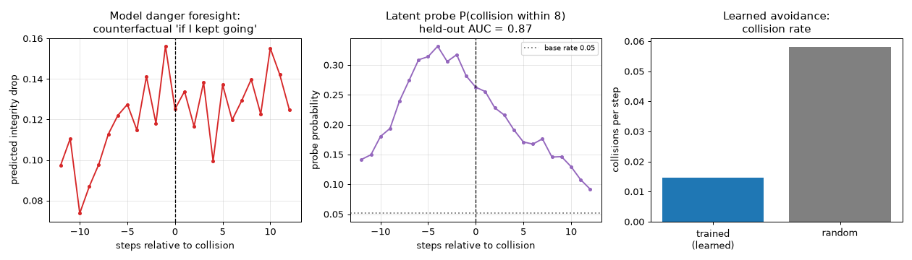
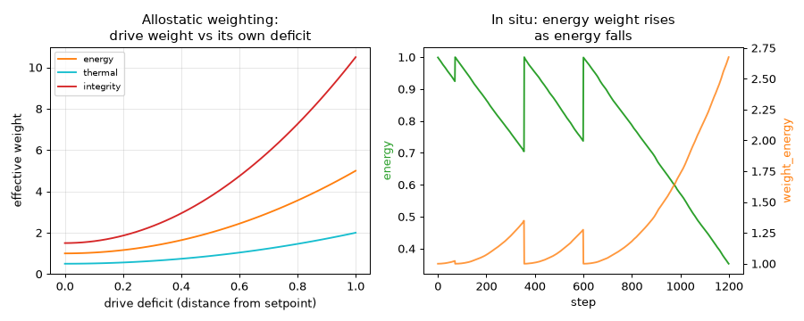
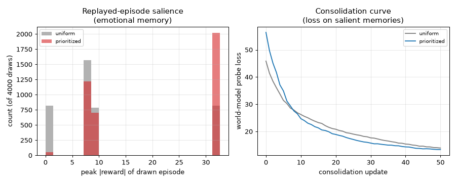
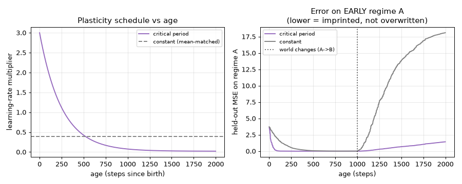
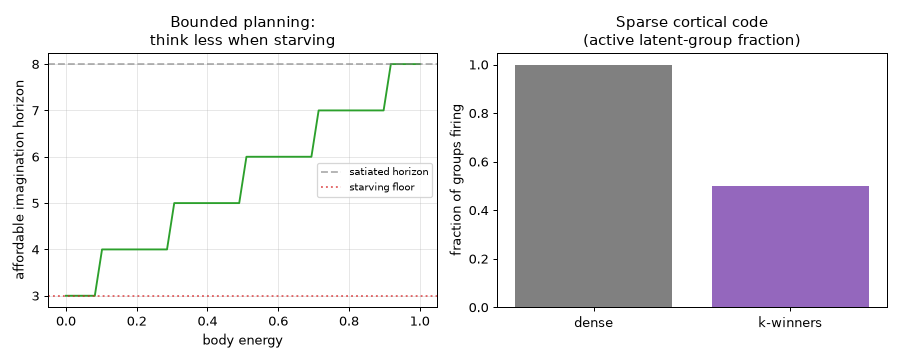
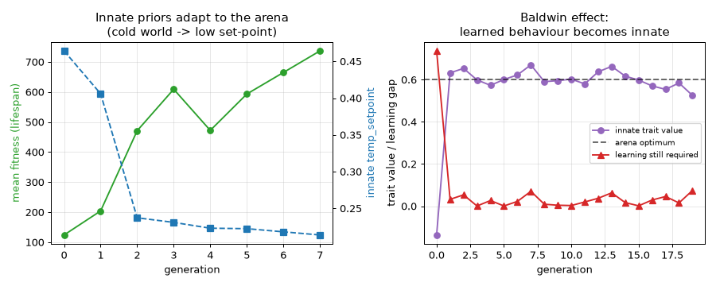
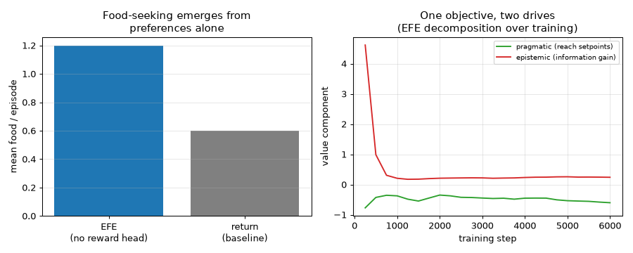
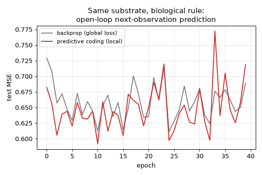

# Embodied Multisensory Learning Agent

A from-scratch (PyTorch) research sandbox for an **embodied agent that learns
almost entirely by predicting its own multisensory stream**. Reward is a thin
layer defined by **homeostasis** (staying alive); exploration is driven by
**curiosity**; behavior is learned **in imagination** with a world model. No
pretrained corpus, no human labels, no hand-coded policy — the world is
self-labeling because the agent's actions change its senses in predictable
ways and the senses cross-predict one another.

Runs on a laptop CPU in the `cpu_small` preset and shows visible learning in
minutes; scales up with `gpu_default`.

**Full operating manual** — every command, flag, config key, output column,
extension point, and troubleshooting table: [docs/MANUAL.md](docs/MANUAL.md).

## Design philosophy

1. **Prediction error is the substrate.** ~99% of the learning signal is
   self-supervised prediction of the agent's own future sensory input. Reward
   is a thin layer on top, not the main driver.
2. **The loop is closed.** Actions produce sensory consequences the agent must
   predict; learning is continuous and online-capable.
3. **Cross-modal self-supervision.** All modalities fuse into a single latent
   state forced to reconstruct every sense — that is where the free labels
   come from.
4. **Reward = drive reduction (homeostasis).** Internal viability variables
   (energy, temperature, integrity) have setpoints; reward is the weighted
   reduction in distance from them. Pain/pleasure are derived from real
   interoceptive channels, not invented outside.
5. **Fear is learned, not coded.** Interoception (including damage) is just
   another modality the world model predicts, so anticipatory avoidance
   emerges from the model foreseeing incoming damage — nothing hardcodes it.
6. **Learn in imagination.** The policy is trained mostly on rollouts inside
   the world model, because a real body cannot be crashed a million times.
7. **Hard constraints are separate from reward.** A shield/override layer sits
   *above* the policy and reward; no predicted return can buy through it.
8. **Deliberately omitted:** self-preservation-against-shutdown,
   self-replication, and status/reputation maximization. This is a
   perception–action–homeostasis sandbox, not an autonomy experiment.

## Architecture

- **Environment** (`env/`) — a continuous 2D "petri arena" with unicycle
  kinematics, respawning food, a smooth hot/cold temperature field, and
  blocking obstacles. Gymnasium-style `reset`/`step`, no physics-engine
  dependency.
- **Senses** (`env/sensors.py`) — multi-rate, egocentric, correlated:
  - *vision* — either egocentric ray-casts (normalized distance + a
    food/wall/none channel) **or a rasterized RGB pixel retina** (walls /
    food / temperature channels) parsed by a CNN — selected by
    `sensor.vision_mode`,
  - *touch* — decaying contact pressure per body sector,
  - *proprioception* — speed, heading, and efference copy of the last motor
    command,
  - *interoception* — energy, internal temperature, integrity (also the
    source of reward),
  - *smell* — a slow chemical gradient toward food that refreshes at a lower
    rate than vision, forcing heterogeneous-rate fusion.
- **World model** (`model/`) — an RSSM (Dreamer lineage): per-modality
  encoders (MLP for vectors, CNN for the retina) fuse into one embedding; a
  GRU deterministic state `h` plus a stochastic latent `z` that is by default
  a **vector of discrete categoricals** with straight-through samples
  (DreamerV3; Gaussian still selectable via `model.latent_kind`); per-modality
  decoders and a **symlog two-hot reward head** (robust to the wide reward
  range) plus a continue head. Loss = reconstruction + balanced KL (free bits)
  + reward + continue.
- **Actor-critic in imagination** (`agent/`) — a reparameterized
  tanh-Gaussian actor and a value critic (EMA target) trained on imagined
  rollouts of the prior dynamics from real posterior start states, using
  lambda-returns. Actor uses backprop-through-dynamics (justified below).
- **Intrinsic motivation** (`intrinsic/`) — Random Network Distillation
  (default) or ensemble disagreement, as a novelty bonus.
- **Safety shield** (`safety/`) — an analytic override above the policy.
- **Replay buffer** (`agent/replay.py`) of real trajectories for the world
  model.

## Install

```bash
pip install -r requirements.txt   # torch CPU wheel is fine
```

## Run — what to look for

```bash
# M1: watch a random agent wander (renders a GIF)
python -m embodied_agent.scripts.random_rollout --config cpu_small

# M4: train the world model offline on random data; open-loop multi-step
#     prediction MSE should drop sharply (the substrate learns before any policy)
python -m embodied_agent.scripts.train_world_model --config cpu_small

# M4 substrate ablation: prediction-only world model (reward heads off)
python -m embodied_agent.scripts.train_world_model --config cpu_small --no-reward

# M5+: full training. Watch eval reward and coverage overtake the random
#      baseline; food-seeking and wall-avoidance emerge with no coded policy
python -m embodied_agent.train --config cpu_small

# M6: does curiosity improve exploration coverage?
python -m embodied_agent.scripts.ablation --set curiosity --config cpu_small

# M7: the shield is respected (0 forbidden-zone entries) and logged
python -m embodied_agent.scripts.shield_demo --config cpu_small

# evaluate a checkpoint
python -m embodied_agent.evaluate --config cpu_small \
    --checkpoint runs/cpu_small/checkpoint.pt --gif

# advanced: the pixel-retina + CNN world model (heavier; GPU-friendly)
python -m embodied_agent.train --config cpu_pixels
python -m embodied_agent.train --config gpu_default   # full stack on GPU

# advanced: measure that fear is *learned* — the model foresees damage and
# the latent encodes "collision imminent" before contact (writes a figure)
python -m embodied_agent.scripts.fear_analysis --config cpu_small \
    --checkpoint runs/cpu_small/checkpoint.pt
```

Outputs land in `runs/<name>/`: `metrics.csv`, `metrics.png` (the
observability dashboard: homeostasis, drive decomposition, world-model
losses, KL, actor-critic, eval-vs-random, coverage, intrinsic/shield),
rollout GIFs, and a checkpoint.

### Representative `cpu_small` results (~20k steps, ~4 min CPU)

| metric | learned policy | random baseline |
|---|---|---|
| eval reward | ≈ −48 | ≈ −79 |
| food eaten / episode | ≈ 5 | ≈ 1 |
| exploration coverage | ≈ 40 cells | ≈ 11 cells |
| world-model open-loop MSE | ≈ 0.037 (from 0.42) | — |

## Advanced (Tier 1) upgrades

The core sandbox is deliberately minimal; these upgrades make the
representation and perception substantially more capable while keeping
`cpu_small` runnable in minutes. All are config-selectable and default-on in
the advanced presets.

- **Discrete categorical latents** (`model.latent_kind: discrete`) — the RSSM
  stochastic state is a vector of categorical variables with straight-through
  one-hot samples and a small uniform mixture (DreamerV3). Multimodal and
  collapse-resistant; the KL stays healthy at the free-bits floor instead of
  vanishing. The original diagonal Gaussian is kept for ablation.
- **Symlog two-hot reward head** (`model.reward_head: twohot`) — reward is
  predicted as a distribution over symlog-spaced bins via cross-entropy
  instead of MSE. This is robust to the environment's wide reward range (tiny
  per-step drive drift vs large food/collision spikes) with no reward
  normalization.
- **Pixel retina + CNN** (`sensor.vision_mode: pixels`) — an egocentric
  rasterized RGB patch (walls / food / temperature) replaces the hand-parsed
  ray-casts, so the world model must learn spatial structure from raw pixels
  through a small conv encoder and a transposed-conv decoder. See
  `configs/cpu_pixels.yaml` (CPU smoke) and `configs/gpu_default.yaml`
  (32×32 retina, large latents).
- **Emergent-fear measurement** (`scripts/fear_analysis.py`,
  `analysis/fear.py`) — turns the "fear is learned, not coded" claim into
  evidence. On a trained `cpu_small` agent it shows all three signatures:
  the world model's **counterfactual danger prediction** ("if I kept driving
  forward") rises approaching a wall; a **linear latent probe** reads
  "collision within K steps" at **AUC ≈ 0.87**, peaking a few steps *before*
  contact; and the learned policy collides **~4× less** than random. None of
  this is hardcoded — it falls out of predicting interoceptive damage as just
  another modality.

  

The GPU preset (`gpu_default`) enables the full stack: 32×32 pixel retina,
32×32 categorical latents, a 512-d deterministic state, and long training.

(Exact numbers vary by seed; the *direction* — policy beats random on reward,
food, and coverage; open-loop prediction error falls — is the point.)

## Biological plausibility (Phase 1)

Tier 1 sharpened *what* the agent represents; this layer changes *how it
learns* toward the way biology learns. Each mechanism maps a named biological
idea onto one integration point, ships a measurement, and is a **config
switch** — the deep-RL baseline (`cpu_small`) is never removed, so every change
is a clean A/B ablation with the same seed. Turn the whole layer on at once
with **`configs/cpu_bio.yaml`**:

```bash
python -m embodied_agent.train --config cpu_bio      # B1–B4 all on
python -m embodied_agent.scripts.neuromod_demo --config cpu_small      # B1
python -m embodied_agent.scripts.sleep_demo --config cpu_small         # B2
python -m embodied_agent.scripts.development_demo --config cpu_small   # B3
python -m embodied_agent.scripts.metabolism_demo --config cpu_small    # B4
```

- **B1 — Neuromodulation & allostasis** (`neuromod.enabled`). Drive weights stop
  being hand-set constants: interoceptive deficits re-weight each drive
  super-linearly (a low-energy body up-weights feeding; near-death integrity
  dominates — *allostasis*). A norepinephrine-like surprise signal (EMA of
  world-model prediction error) raises the effective learning rate, and a
  dopamine-like |TD-error| tone gates the actor. The energy weight spikes as
  energy falls — arbitration becomes state-dependent, not fixed.

  

- **B2 — Sleep, consolidation & dreaming** (`sleep.enabled`). A circadian clock
  splits life into wake (forage, *light* adaptation) and sleep (the bulk of
  consolidation). Replay becomes **salience-weighted** — high-|reward|
  ("emotional", near-death) memories are replayed preferentially — and
  **dreaming** adds extra imagination passes. Prioritized replay concentrates on
  salient memories and drives their world-model error down faster than uniform.

  

- **B3 — Continual life & critical periods** (`dev.enabled`). One irreversible
  life instead of resampled episodes: truncation only *segments* memory while
  the same body, recurrent state, and age carry on; only death starts a new
  individual. Plasticity is high at birth and anneals to a mature floor (a
  **critical period**), so early experience imprints and resists being
  overwritten when the world later changes.

  

- **B4 — Metabolic cost of cognition & sensorimotor realism** (`metab.enabled`,
  `model.sparse_latent`). Thinking is no longer free: every imagined step debits
  the body's energy, and the affordable planning horizon shrinks as energy falls
  (the agent **thinks less when starving**). The closed loop gains sensory/motor
  latency and motor noise, and an optional **k-winners** latent fires only a
  fraction of its groups (sparse cortical assemblies).

  

Each demo runs the mechanism **on vs its ablation** (several take `--ablate` for
the end-to-end comparison). The head-to-head switches: allostatic vs fixed drive
weights (survival); salience-prioritized vs uniform replay (consolidation of
salient memories); critical-period vs constant plasticity (early-experience
imprinting); energy-bounded vs free planning (planning depth vs energy).

### Phase 2 — the evolutionary outer loop (B5)

Phase 1 is a single lifetime. **B5** adds the loop *above* the lifetime: a
population of individuals whose **genome** — innate homeostatic set-points and
base drive weights, sensor morphology (`n_rays`, `fov_deg`), an innate
`action_bias` instinct, and early plasticity — is set by evolution, expressed
onto a `Config`, then tuned by lifetime learning (B1–B4). Fitness is
**endogenous** (how long the body survives, how much it eats, how many
offspring it bears — reproduction is a homeostatic drive, `evolution.
reproduction`), not a designed objective. Longer-lived genomes leave more
mutated descendants.

```bash
python -m embodied_agent.scripts.evolution_demo --config cpu_small     # ~25s
```



Two results: in a cold, food-scarce arena the **innate priors adapt** —
population fitness rises and the innate thermal set-point slides toward the cold
world's optimum over generations (left). And a **Baldwin effect** (right): when
a trait can be both learned within a life and inherited, evolution moves its
*innate* component toward the adaptive value, so each generation needs less
learning to reach competence — a learned behaviour becomes innate. The genome →
phenotype → fitness → selection machinery lives in `evolution/` (`Genome`,
`Population`); `train.live_one_life()` provides the full-life fitness that also
runs lifetime learning.

### Phase 3 — the learning theory (B6, B7), research-grade

The last two modules address *how* learning happens, not just what it pursues.
Both are config switches measured against the current system; both are honest
about scale.

**B6 — active inference (`agent.objective: expected_free_energy`).** Instead of
maximizing λ-returns of a reward head plus a separately-scaled curiosity bonus,
the actor minimizes **expected free energy** — a single quantity uniting a
*pragmatic* term (log-preference of the predicted interoceptive outcome under a
prior centred on the homeostatic setpoints) and an *epistemic* term (ensemble
disagreement = expected information gain), both in natural units.

```bash
python -m embodied_agent.scripts.active_inference_demo --config cpu_small
```



Food-seeking emerges from *preferences alone* — matching (here exceeding) the
reward-based baseline with **no reward head and no tuned curiosity weight**
(left) — and the one objective genuinely decomposes into two drives, the
epistemic term largest early (explore the unknown world) then receding as the
pragmatic term (drive toward setpoints) carries on (right). These `cpu_small`
numbers are single-seed and noisy; the ensemble epistemic term is
Plan2Explore-style and expected to be more reliable at scale.

**B7 — local learning (`model.learning_rule: predictive_coding`).** The deepest
gap: cortex does not run BPTT over a global loss. **Predictive coding**
(`model/predictive_coding.py`) uses per-layer error neurons, inference by local
error minimization, and a purely **local Hebbian** weight update (post-synaptic
error × pre-synaptic activity) — no backward pass. Whittington & Bogacz showed
this approximates the backprop gradient.

```bash
python -m embodied_agent.scripts.predictive_coding_demo --config cpu_small
```



On the project's own substrate — open-loop next-observation prediction — the
local rule tracks backprop's test MSE essentially on top of it, and a unit test
confirms its weight update points the same way as the backprop gradient
(cosine > 0.99). The recurrent world model itself remains BPTT (it rejects the
switch loudly); a full predictive-coding RSSM is the natural extension.

## Arbitration (which drive is winning)

Reward is an explicit weighted sum of energy, thermal, and integrity drive
reduction plus intrinsic curiosity. The weights live in `RewardConfig` and
every drive's instantaneous contribution is logged, so "which drive is
winning right now" is answerable from `metrics.csv` / `metrics.png`. Biology
solves this arbitration with neuromodulation; **hand-set weights are the known
weak point here.**

## Why backprop-through-dynamics for the actor

The learned RSSM is fully differentiable and the tanh-Gaussian action is
reparameterized, so analytic return gradients flow straight through the
imagined trajectory into the actor. In this low-dimensional, short-horizon
sandbox that is markedly more sample-efficient than a REINFORCE-style
estimator; the cost is reliance on world-model gradient quality, which is
acceptable because the substrate is validated first (milestone 4). Returns
are divided by an EMA of their scale so the entropy coefficient is
independent of the (large, configurable) reward scale.

## Curiosity ablation (cpu_small, 8k steps, 2 seeds)

| condition | coverage | food | eval reward |
|---|---|---|---|
| no curiosity | 13.5 | 0.9 | −81.7 |
| RND | 15.8 | 1.7 | −105.7 |
| disagreement | 15.5 | 1.2 | −93.7 |

Removing curiosity reduces exploration coverage and food discovery; the
bonus costs some extrinsic reward (explore/exploit trade). Be honest about
the error bars: at this tiny scale the effect is modest and seed variance is
large — the intrinsic `scale` must be sized comparable to the typical
per-step extrinsic reward or the bonus is swamped entirely (that constant
lives in `IntrinsicConfig` with a comment). Longer runs and more seeds
sharpen the separation.

## Known hard parts & honest limitations

- **Sample efficiency in a non-resettable body.** A real body cannot be
  crashed a million times; imagination helps but the world model must be good
  first, and early exploration is fragile.
- **Multi-rate sensor fusion.** Smell updates slower than vision on purpose;
  the RSSM has to integrate heterogeneous rates, and mis-set rates hurt.
- **Drive arbitration.** Fixed reward weights are brittle — a slightly
  different weighting changes whether the agent prioritizes food, warmth, or
  safety. Neuromodulatory, context-dependent weighting is the right answer and
  is not implemented.
- **Reward scale sensitivity.** Drives move slowly, so rewards are rescaled;
  the critic target magnitude matters and is mitigated (not solved) by return
  normalization.
- **Not SOTA, not distributed.** Single machine, small nets, correctness and
  observability over performance.
- **Emergent avoidance is qualitative.** Anticipatory braking before walls and
  drift toward the thermal comfort zone appear, but this sandbox measures them
  through logs/behavior rather than a formal causal test.

## Future work

- **Learning-progress curiosity** (Oudeyer-style): reward the *rate of
  decrease* of prediction error rather than raw novelty/error. It would slot
  into `intrinsic/` behind the same `reward(feat)` / `train_step(feat)`
  interface as RND and disagreement.
- **Forward-dynamics ensemble disagreement**: condition each ensemble member
  on the action and predict the next latent; current disagreement uses a
  shared random target for simplicity.
- **Hierarchical prediction**: a slow latent predicting long-horizon
  structure above the fast latent, with errors propagating up only when the
  lower level fails to explain them.

## Layout

```
embodied_agent/
  env/         arena, sensors, homeostasis (+ reproduction, B5), neuromod (B1)
  model/       encoders/decoders, rssm (sparse latent, B4), world model + heads
  agent/       actor-critic (+ action_bias, B5), imagination, replay (salience,
               B2), online agent, sleep (B2), development (B3), metabolism (B4)
  evolution/   genome, population + selection/mutation (B5)
  intrinsic/   RND, ensemble disagreement
  safety/      hard-constraint shield
  configs/     cpu_small.yaml, cpu_pixels.yaml, cpu_bio.yaml, gpu_default.yaml
  viz/         arena renderer, metrics plots
  scripts/     random_rollout, train_world_model, ablation, shield_demo,
               fear_analysis, neuromod_demo, sleep_demo, development_demo,
               metabolism_demo, evolution_demo
  tests/       env, sensors, replay, model, shield, advanced, bio, smoke
  train.py     training (run(cfg)); wake/sleep, continual life, live_one_life
  evaluate.py  load a checkpoint and report vs random
```

## Reproducibility

Everything is seeded (`utils/seeding.py`); `env.fixed_layout` gives a
deterministic arena for eval. Metrics are written to CSV and rendered to PNG.
